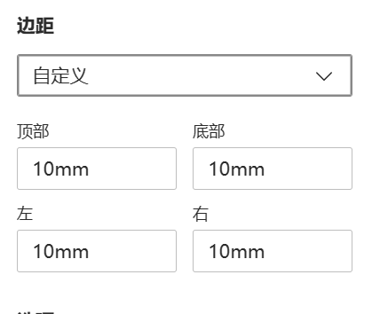

### 打印CSDN文章，删除不需要的元素
1. 点击网页右键-检查-点击控制台，粘贴下面的代码
```javascript
$(function(){
	/*从被选元素body移除一个类页面样式*/
	$("body").removeClass("nodata");
	/*删除顶部导航*/
	$("#csdn-toolbar").remove();
	/*删除左侧导航*/
	$("aside").remove();
	/*删除右侧悬浮*/
	$(".csdn-side-toolbar").remove();
	/*删除CSDN文章上方*/
	$(".article-header-box .article-info-box").remove();
	$("#blogColumnPayAdvert,#blogHuaweiyunAdvert").remove();
	/*展开CSDN文章中被隐藏的代码段：从被选元素<pre class="set-code-hide"移除一个类页面样式*/
	$('pre[class="set-code-hide prettyprint"]').removeClass("set-code-hide");
	/*删除CSDN文章中被隐藏的代码段上面的遮罩*/
	$(".hide-preCode-box").remove();
	/*删除CSDN文章下方*/
	$(".more-toolbox-new").remove();
	$(".reward-box-new").remove();
	$(".recommend-tit-mod").remove();
	$(".blog-footer-bottom").remove();
	/*删除CSDN文章下方评论、其他博客链接*/
	$(".comment-box, .recommend-box, #csdn-shop-window, .template-box").remove();
	/*删除CSDN文章下方公众号链接、笑脸评级*/
	$("#blogExtensionBox, #recommendNps").remove();
	/*修改CSDN文章css样式为》默认样式'display':'contents'或自定义宽度'width':'1100px'或自定义宽度'width':'825px'*/
	$("main").css({'width':'1100px'}); 
	/*弹出打印窗口》另存为PDF文件*/
	window.print();
});
```
2. 出现打印框，可以在打印-更多设置中，自定义页边距，解决部分文字显示不全的问题
