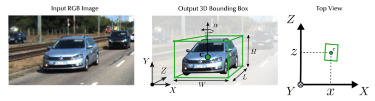

### 1. 单目3D检测的任务
给定一个输入图像(左)，它的目标是预测一个3D边界框(由它的位置(x, y, z)，尺寸(h, w, l)和每个对象中间点的旋转角θ)。为了更好地可视化，我们还展示了鸟瞰图(右图)。 

### 2. 常用的数据集
主要使用KITTI 3D数据集，Waymo和nuScenes使用多个不同角度的相机提供360度的全景图像，也有一些论文在用。这三个数据集只发布了训练集和验证集，在测试集上的评估需要在他们官方的测试服务器上进行。 
以下为KITTI 3D的其他信息： 
<ul>
    <li>种类：汽车、行人和骑自行车的人</li>
    <li>场景：不涉及雨天和夜晚</li>
    <li>单目</li>
</ul>
