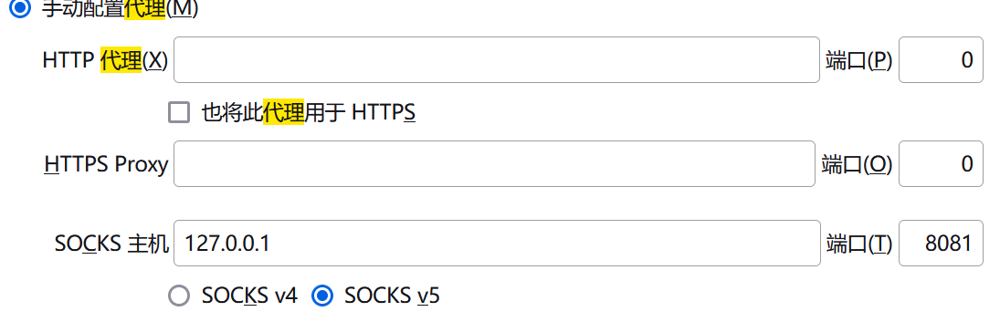

# 关于使用SSH进行流量转发二三事

## 前言

不想说了hhh

## 操作

### 1. 将本机的流量转发到服务器中

在Windows或Linux终端上输入这一行命令

```bash
ssh -N -D 127.0.0.1:8081 username@server_ip -p port_xxx
```

下面是copilot的解释

- `-N`: 这个选项告诉 SSH 不要执行任何远程命令，只创建隧道。
- `-D 127.0.0.1:8081`: 这指定了本地端口 8081，用于创建 SOCKS 代理。
- `username@server_ip`: 这是您要连接的远程服务器的地址。`username` 是用户名，`server_ip` 是服务器的域名或 IP 地址。
- `-p port_xxx`:如果你的服务器ssh端口不在`22`上，需要指定端口，如`-p 25778`

没有问题的话，它应该会没有输出，然后一直保持运行状态。可能会提示本机端口占用，只需要换别的端口就可以了。

然后，你就可以在Firefox浏览器中（一位博主说Chrome浏览器上不能单独设置，我没有考证）设置代理，在设置上搜一下代理，像我这样设置就可以了



然后，你就可以愉快的使用本机浏览器来访问网页，但那些网站接收到的流量来自你的服务器，你可以找个可以查看ip的网站，应该是不一样的

### 2. 将服务器的流量转发到本机中

#### 2.1 ssh命令

```bash
ssh -R remote_proxy_port:localhost:local_proxy_port user_name@remote_ip -p remote_ssh_port
```

特别感谢mill413的[博客](https://mill413.github.io/posts/%E9%80%9A%E8%BF%87ssh%E8%AE%A9%E8%BF%9C%E7%A8%8B%E4%B8%BB%E6%9C%BA%E4%BD%BF%E7%94%A8%E6%9C%AC%E5%9C%B0%E4%B8%BB%E6%9C%BA%E7%9A%84%E7%BD%91%E7%BB%9C%E4%BB%A3%E7%90%86/)

如果你区分不开remote_proxy_port和local_proxy_port ，你可以都设置成你本地clash占用的端口

#### 2.2 proxychains

你还需要用到一个工具，叫proxychains，因为wget是不支持socks代理的

~~大部分推荐的是tsocks，但tsocks已经是十几年前的东西了，实测也不能用~~

（以下参考会长君的[博客](https://cloud.tencent.com/developer/article/2288071)）

如果你是Ubuntu系统，你应该可以执行下面命令之一进行安装

```bash
sudo apt install proxychains -y 
```

```bash
sudo apt install proxychains4 -y
```

安装后默认配置文件在 `/etc/proxychains.conf` 或 `/etc/proxychains4.conf` ，通过vi或nano编辑该文件，拉到最下面填入自己的代理信息，如果没设置用户密码认证则省略，添加后保存退出。

```bash
[ProxyList]
# add proxy here ...
# meanwile
# defaults set to "tor"
#socks4  127.0.0.1 9050  ##注释掉或者直接删掉默认的本地代理
socks5  连接IP地址 连接端口 用户名 密码(用户名和密码一般用不到)
```

然后，你就可以用`proxychains wget url`(url替换成你自己的资源连接)，应该就没有问题了

以上为参考博客中的内容

下面是我的安装过程（**第二种方法**）

```bash
# 克隆项目库
https://github.com/haad/proxychains.git
cd proxychains
# 下面为官方源码编译的过程
# needs a working C compiler, preferably gcc
./configure
make
sudo make install
```

然后，我开始找配置文件在哪里，以下为官方对配置的说明

proxychains looks for configuration in the following order:

- SOCKS5 proxy host ip and port in environment variable ${PROXYCHAINS_SOCKS5_HOST} ${PROXYCHAINS_SOCKS5_PORT} (if ${PROXYCHAINS_SOCKS5_PORT} is set, no further configuration will be searched. if ${PROXYCHAINS_SOCKS5_HOST} isn't set, host ip will become "127.0.0.1")

- file listed in environment variable ${PROXYCHAINS_CONF_FILE} or provided as a -f argument to proxychains script or binary.

- ./proxychains.conf

- $(HOME)/.proxychains/proxychains.conf

- /etc/proxychains.conf

你需要指定PROXYCHAINS_CONF_FILE

```bash
#下面是一个例子，仅对当前终端生效
export PROXYCHAINS_CONF_FILE = /etc/proxychains.conf
```
后面就可以愉快使用了